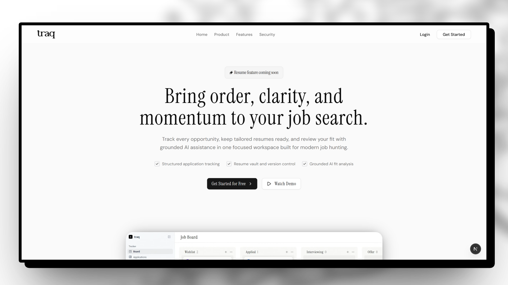

# Traq

Traq is a job search tracking application built with Next.js. It helps candidates organize job applications, manage resume versions, and compare resumes against job descriptions using AI-assisted analysis.

> Status: Under development. Core product flows are being built and refined, so features, data models, and setup details may change.



## Current Project Status

The project currently includes:

- Landing page with authentication entry points.
- Email/password and Google authentication through Better Auth.
- User-specific dashboard with a kanban-style job application board.
- Applications view for browsing tracked opportunities by status.
- Resume Vault for uploading, previewing, replacing, and deleting resume files.
- Cloudflare R2/S3-compatible storage integration for resume files.
- Job description scraping and structured extraction.
- AI resume-to-job-description matching with fit scores, matched skills, missing skills, requirement assessments, and rewrite suggestions.
- MongoDB/Mongoose data models for users, boards, columns, job applications, and resumes.

## Tech Stack

- Next.js 16
- React 19
- TypeScript
- Tailwind CSS 4
- Better Auth
- MongoDB and Mongoose
- AWS SDK for S3-compatible storage
- OpenRouter AI SDK
- shadcn-style UI primitives
- Lucide React icons

## Getting Started

Install dependencies:

```bash
npm install
```

Create a `.env` file in the project root with the required environment variables:

```env
DATABASE_URI=
NEXT_PUBLIC_BETTER_AUTH_URL=
GOOGLE_CLIENT_ID=
GOOGLE_CLIENT_SECRET=
OPENROUTER_KEY=
S3_API=
R2_ACCESS_TOKEN_ID=
R2_SECRET_ID=
NEXT_PUBLIC_R2_PUBLIC_URL=
```

Run the development server:

```bash
npm run dev
```

Open [http://localhost:3000](http://localhost:3000) in your browser.

## Available Scripts

```bash
npm run dev
```

Starts the local development server.

```bash
npm run build
```

Creates a production build.

```bash
npm run start
```

Starts the production server after building.

```bash
npm run lint
```

Runs ESLint.

## Project Structure

```text
app/                  Next.js app routes and layouts
components/           UI, landing, dashboard, kanban, application, and resume components
data/                 Local static data
lib/                  Auth, database, server actions, hooks, models, and utilities
public/               Static assets
```

## Notes

- This project is private and actively under development.
- Resume uploads depend on a configured S3-compatible storage bucket.
- AI job description extraction and resume analysis require an OpenRouter API key.
- MongoDB is required for authentication and product data.
